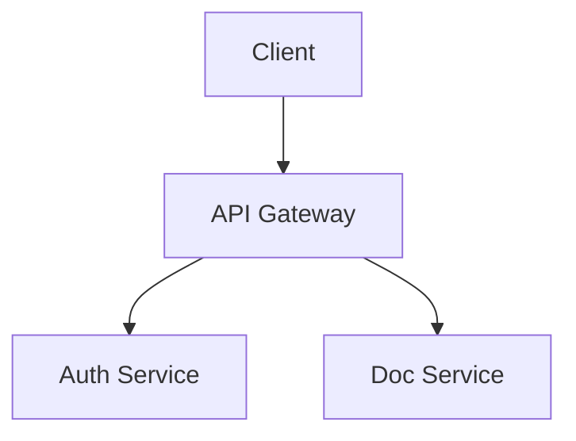

## Summary

Add a `diagram` output mode that generates [Mermaid](https://mermaid.js.org) diagrams from technical transcript content. This allows developers to turn architecture walkthroughs, API flow explanations, and system design talks into renderable diagrams.

## Background

devdocs-forge-agent uses mode files (`modes/`) as Markdown prompt fragments that are assembled into an AI prompt at generation time. Adding a new mode requires:

1. A `modes/diagram.md` prompt file (no TypeScript needed)
2. Registering the mode name in `src/pipeline/prompt-builder.ts`

No other code changes are strictly required for a basic mode.

## Files to Touch

| File | Change |
|------|--------|
| `modes/diagram.md` | Create — prompt instructions for Mermaid diagram generation |
| `src/pipeline/prompt-builder.ts` | Add `'diagram'` to `VALID_MODES` array |
| `examples/transcripts/` | Add an example architecture transcript |
| `examples/outputs/diagram-example.md` | Add example output |
| `README.md` | Add `diagram` row to the Modes table |
| `docs/MODES.md` | Document the new mode |

## Implementation Guide

### `modes/diagram.md`

The prompt file should instruct the AI to:
- Identify system components, flows, or sequences from the transcript
- Generate one or more Mermaid code blocks (flowchart, sequence, C4 context, etc.)
- Label each diagram clearly
- Include a written explanation alongside each diagram
- Use standard Mermaid syntax that renders in GitHub, Docusaurus, and GitBook

Example structure for generated output:
```markdown
## Architecture Overview



The client sends all requests through the API Gateway...
```

### Registering the mode

In `src/pipeline/prompt-builder.ts`, add `'diagram'` to:
```typescript
export const VALID_MODES = ['blog', 'docs', 'docusaurus', ..., 'diagram'] as const;
```

## Acceptance Criteria

- [ ] `npm run generate -- --file input/my-architecture-notes.md --type diagram` works
- [ ] Output contains at least one valid Mermaid code block
- [ ] `modes/diagram.md` prompt is clear and produces useful diagrams
- [ ] Example transcript added to `examples/transcripts/`
- [ ] Example output added to `examples/outputs/`
- [ ] README modes table updated
- [ ] `docs/MODES.md` updated
- [ ] Tests pass (`npm test`)

## Difficulty

Low — the core change is writing a good `modes/diagram.md` prompt file. No TypeScript expertise needed.
