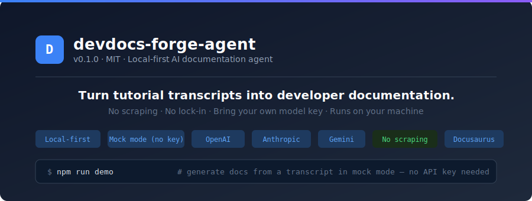
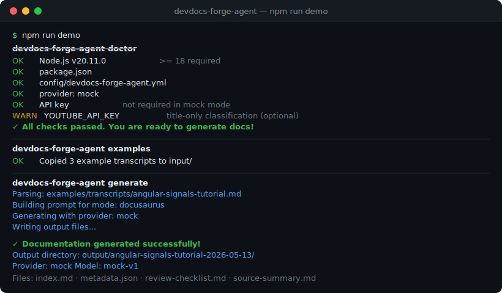
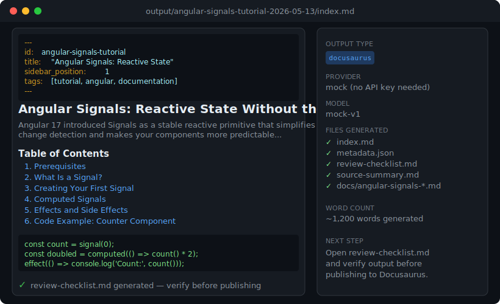
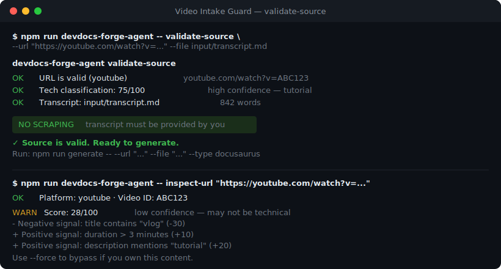
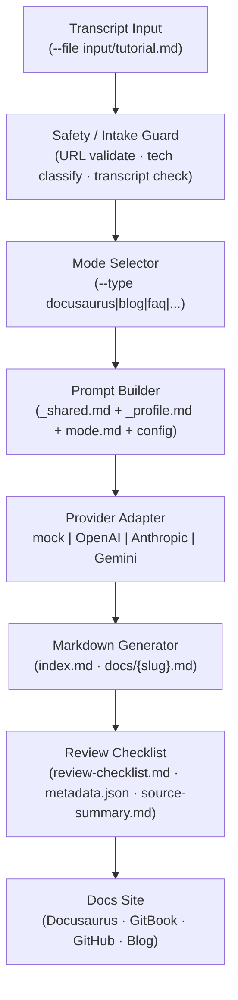

<div align="center">

# devdocs-forge-agent

**Turn tutorial transcripts into beautiful developer documentation.**

[](https://nodejs.org)
[](https://typescriptlang.org)
[](LICENSE)
[](https://platform.openai.com)
[](https://anthropic.com)
[](https://aistudio.google.com)
[](https://commonmark.org)
[](https://docusaurus.io)
[](https://gitbook.com)
[](#)

<br/>

<p align="center">
  
</p>

*Videos are great for learning. Docs are great for shipping.*

**devdocs-forge-agent** is a local-first AI documentation agent that turns tutorial transcripts, product demos, and lesson notes into developer documentation — with source attribution, human review checklists, and safe local-first workflows.

**[📖 Website](https://ankitparekh007.github.io/devdocs-forge-agent/)** · **[🐛 Issues](https://github.com/AnkitParekh007/devdocs-forge-agent/issues)** · **[✨ Good First Issues](https://github.com/AnkitParekh007/devdocs-forge-agent/issues?q=label%3A%22good+first+issue%22)**

</div>

---

## Current Status

**devdocs-forge-agent is a v0.1.1 CLI MVP** — ready for local testing, open-source contributions, and feedback.

- Runs locally from your terminal — not a hosted SaaS product
- Mock mode generates real output with no API key required
- Real providers (OpenAI, Anthropic, Gemini) require your own API key
- Generated docs are first drafts — always review before publishing
- CI tests on Node.js 22 and 24 (Ubuntu + macOS); minimum runtime: Node ≥ 18

---

> **⭐ If this project saves you documentation time, please star the repo so more developers can discover it.**

---

## Try It in One Command

```bash
git clone https://github.com/AnkitParekh007/devdocs-forge-agent.git
cd devdocs-forge-agent
npm install
cp .env.example .env
npm run demo
```

`npm run demo` runs doctor → copies example transcripts → generates a Docusaurus page from the Angular Signals tutorial → validates the output. No API key required — mock mode works out of the box.

Generated files appear in `output/angular-signals-tutorial-{date}/`:

```
output/angular-signals-tutorial-2026-05-13/
├── index.md              ← generated documentation
├── metadata.json         ← provider, model, timestamp, source
├── review-checklist.md   ← human review tasks before publishing
├── source-summary.md     ← word count, source URL, slug
└── docs/
    └── angular-signals-tutorial.md  ← Docusaurus-ready with frontmatter
```

---

## Demo

<p align="center">
  
</p>

---

## Why This Exists

Videos are great for learning. Docs are great for shipping.

Most technical knowledge gets trapped inside tutorial videos, product demos, meeting recordings, course lessons, and internal walkthroughs. That makes it hard to search, review, version, reuse, or turn into long-term team knowledge.

**devdocs-forge-agent** helps convert that raw learning material into reviewable, version-controlled developer documentation — with source attribution, human review checklists, and safe local-first workflows.

It creates a strong first draft and a structured review process, not a replacement for human technical writers. Every run includes a `review-checklist.md` to verify before publishing.

---

## Before → After

Turn messy learning material into structured docs developers can search, review, commit, and improve.

| Before              | After                        |
|---------------------|------------------------------|
| Tutorial transcript | Step-by-step Docusaurus page |
| Product demo notes  | Help documentation           |
| Course lesson       | Lesson page with objectives  |
| Raw learning notes  | Blog post + FAQ              |
| Bug walkthrough     | Troubleshooting guide        |
| API demo transcript | README tutorial              |

---

## What Is This?

**devdocs-forge-agent** is a local-first AI documentation agent CLI that converts tutorial transcripts, product demos, and lesson notes into structured developer documentation.

You bring the transcript. devdocs-forge-agent generates:

- Docusaurus documentation pages
- Developer blog posts
- GitHub README tutorials
- FAQs and troubleshooting guides
- Course lesson pages
- SEO metadata and social summaries

No YouTube scraping. No video downloading. No account required. Works entirely on your machine with your own API key — or in mock mode without one.

---

## Why Developers Use This

- **Local-first** — runs entirely on your machine, no cloud backend
- **Mock mode** — generates real output with zero API keys for development
- **Bring your own model key** — OpenAI, Anthropic, Gemini, or Ollama (planned)
- **Markdown-first outputs** — drop directly into any docs site
- **Docusaurus/GitBook-ready** — correct frontmatter, admonitions, and structure out of the box
- **Built for developer tutorials** — understands code walkthroughs, API demos, course lessons
- **No scraping** — only processes transcripts you own or have permission to use
- **No lock-in** — fork it, modify it, extend it with your own providers and modes
- **Agent-friendly** — full `AGENTS.md` and `CLAUDE.md` for AI-assisted development workflows
- **Contributor-friendly** — add a provider or mode in under 50 lines of TypeScript

---

## Perfect For

| Who                          | Use case                                                          |
|------------------------------|-------------------------------------------------------------------|
| **Developer YouTubers**      | Turn tutorial recordings into Docusaurus sites                    |
| **DevRel teams**             | Convert demo recordings into onboarding docs                      |
| **Course creators**          | Generate lesson pages from lecture notes                          |
| **Open-source maintainers**  | Create READMEs and troubleshooting guides from issue walkthroughs |
| **Technical bloggers**       | Draft dev.to and Hashnode posts from talk notes                   |
| **SaaS engineering teams**   | Generate internal runbooks from Loom transcripts                  |

---

## Not Another YouTube Scraper

> devdocs-forge-agent does not scrape YouTube videos, download captions, or access any video platform API for content.
>
> The optional `--url` flag is for **attribution** (linking back to the source) and **safety classification** (checking whether the video looks like a technical tutorial). You must always provide your own transcript with `--file`.

---

## Generated Output Preview

<p align="center">
  
</p>

---

## Quick Start

```bash
git clone https://github.com/AnkitParekh007/devdocs-forge-agent.git
cd devdocs-forge-agent
npm install
cp .env.example .env

# One-command demo (mock mode, no API key)
npm run demo

# Or generate manually from your own transcript
npm run generate -- --file input/my-tutorial.md --type docusaurus
npm run verify
```

---

## Model Provider Setup

By default, devdocs-forge-agent runs in **mock mode** — no API key required.

```env
DEVDOCS_PROVIDER=mock
```

Switch to a real provider by editing your `.env`:

**OpenAI:**
```env
DEVDOCS_PROVIDER=openai
OPENAI_API_KEY=sk-...
OPENAI_MODEL=gpt-4.1-mini
```

**Anthropic Claude:**
```env
DEVDOCS_PROVIDER=anthropic
ANTHROPIC_API_KEY=sk-ant-...
ANTHROPIC_MODEL=claude-3-5-sonnet-latest
```

**Google Gemini:**
```env
DEVDOCS_PROVIDER=gemini
GEMINI_API_KEY=...
GEMINI_MODEL=gemini-2.0-flash
```

See the [Providers docs](https://ankitparekh007.github.io/devdocs-forge-agent/docs/providers) for full setup.

---

## Video URL Safety

<p align="center">
  
</p>

When you pass `--url` to `generate`, the **Video Intake Guard** runs before generation:

1. **URL validation** — only `youtube.com`, `youtu.be`, and `vimeo.com` are accepted
2. **Tech video classification** — scores the video's title, description, tags, and category to verify it looks like a technical tutorial (requires `YOUTUBE_API_KEY` for full metadata; degrades gracefully without it)
3. **Transcript requirement** — you must always provide `--file` with your own transcript

The `video_intake` guard is **enabled by default** in `config/devdocs-forge-agent.yml`. URL-only generation is **blocked by design** (`allow_url_only_generation: false`).

```bash
# Inspect a video URL (classification only, no transcript needed)
npm run devdocs-forge-agent -- inspect-url "https://youtube.com/watch?v=..."

# Validate a URL + transcript before generation
npm run devdocs-forge-agent -- validate-source \
  --url "https://youtube.com/watch?v=..." \
  --file input/your-transcript.md

# Generate with URL attribution + intake guard
npm run generate -- \
  --url "https://youtube.com/watch?v=..." \
  --file input/your-transcript.md \
  --type docusaurus

# Bypass low-confidence classification (only if you own the content)
npm run generate -- \
  --url "https://youtube.com/watch?v=..." \
  --file input/your-transcript.md \
  --type docusaurus \
  --force
```

---

## CLI Commands

```bash
# Initialize your project
npm run init

# Check your setup
npm run doctor

# One-command demo (mock mode)
npm run demo

# Generate documentation from a transcript
npm run generate -- --file input/my-tutorial.md --type docusaurus
npm run generate -- --file input/my-tutorial.md --type blog
npm run generate -- --file input/my-tutorial.md --type faq

# Generate with video URL attribution
npm run generate -- --url "https://youtube.com/watch?v=..." --file input/my-tutorial.md

# Process all transcripts in a directory
npm run batch -- --dir input/

# Inspect and classify a video URL
npm run devdocs-forge-agent -- inspect-url "https://youtube.com/watch?v=..."

# Validate a URL + transcript pair before generation
npm run devdocs-forge-agent -- validate-source --url "..." --file input/my-transcript.md

# List available providers
npm run providers

# Validate generated outputs
npm run verify
```

All output goes to `output/{slug}-{YYYY-MM-DD}/`.

See the [CLI Commands reference](https://ankitparekh007.github.io/devdocs-forge-agent/docs/cli-commands) for the full flag reference.

---

## Output Structure

Every generation run produces a timestamped output directory:

```
output/angular-signals-tutorial-2026-05-13/
├── index.md              ← main generated documentation
├── metadata.json         ← provider, model, word count, source URL, timestamp
├── review-checklist.md   ← human review tasks before publishing
├── source-summary.md     ← source word count, slug, title
└── docs/
    └── angular-signals-tutorial.md   ← Docusaurus-ready copy with YAML frontmatter
```

Run `npm run verify` to validate all outputs before publishing.

---

## Modes

| Mode              | Command                  | What It Generates                     |
|-------------------|--------------------------|---------------------------------------|
| `docusaurus`      | `--type docusaurus`      | Docusaurus v3 page with frontmatter   |
| `blog`            | `--type blog`            | Developer blog post with SEO          |
| `docs`            | `--type docs`            | General documentation page            |
| `gitbook`         | `--type gitbook`         | GitBook-formatted doc with hints      |
| `readme`          | `--type readme`          | GitHub README tutorial                |
| `faq`             | `--type faq`             | FAQ organized by category             |
| `troubleshooting` | `--type troubleshooting` | Error/fix troubleshooting guide       |
| `lesson`          | `--type lesson`          | Course lesson with objectives         |
| `social`          | `--type social`          | LinkedIn + X + dev.to summaries       |
| `changelog`       | `--type changelog`       | Keep A Changelog format release notes |
| `seo`             | `--type seo`             | SEO metadata and keyword analysis     |

---

## Example Output

Running on `examples/transcripts/angular-signals-tutorial.md` with `--type docusaurus`:

```markdown
---
id: angular-signals-tutorial
title: "Angular Signals: Reactive State Without the Complexity"
sidebar_label: "Angular Signals"
sidebar_position: 1
description: "Learn how to use Angular Signals for reactive state..."
tags:
  - tutorial
  - documentation
---

Angular 17 introduced Signals as a stable reactive primitive...

## Prerequisites
...

## What Is a Signal?
...

## Review Checklist
- [ ] Facts verified against source transcript
- [ ] Code snippets tested locally
```

---

## How It Works



---

## What This Proves

> For recruiters, hiring managers, and anyone evaluating AI developer tooling skills.

devdocs-forge-agent is not a toy project. It is a working CLI tool with a real user experience, a test suite, CI/CD, and documentation — built to demonstrate specific engineering capabilities:

| Capability | Where to Look |
|---|---|
| **Provider abstraction pattern** | `src/providers/provider.types.ts` + `provider-registry.ts` — one interface, four implementations, zero coupling |
| **Pipeline orchestration** | `src/pipeline/generation-pipeline.ts` — clear single-responsibility stages |
| **Prompt engineering as code** | `modes/` folder — modular, human-editable prompt files that non-engineers can contribute to |
| **Zod schema validation** | `src/config/config.schema.ts` — typed config with clear error messages |
| **CLI design with Commander.js** | `src/cli/index.ts` + 10 command files |
| **Native fetch, no SDK bloat** | `src/providers/openai.provider.ts` — auditable, minimal, fast install |
| **AI-safe output design** | Every run produces `review-checklist.md` + `metadata.json` with `reviewRequired: true` |
| **Test suite without mocking FS** | `tests/` — 9 test files covering core logic |
| **CI on 4 environments** | Ubuntu + macOS × Node 22 + 24 |

Run the project in 5 minutes: `git clone` → `npm install` → `npm run demo`.

See [`docs/recruiter-review-guide.md`](docs/recruiter-review-guide.md) for a full evaluation walkthrough.

---

## Why Developers Star This

- **Zero-config demo** — `npm run demo` works with no API key, generates real output
- **BYO model** — OpenAI, Anthropic, Gemini, or local Ollama (planned) — no provider lock-in
- **Markdown-first** — outputs drop directly into Docusaurus, GitBook, GitHub, or any Markdown-based docs site
- **Prompt engineering as text files** — the `modes/` folder is plain Markdown, not code. Anyone can improve the prompts
- **Review-first by design** — every output includes a human review checklist before publishing
- **Agent-friendly** — `AGENTS.md` and `CLAUDE.md` make AI-assisted development workflows first-class
- **9 labeled good first issues** — contributor onramp is real, not aspirational
- **Local-first, no telemetry** — nothing leaves your machine except your own API calls

---

## Project Structure

```
devdocs-forge-agent/
├── src/
│   ├── cli/              # CLI entry point and commands
│   ├── config/           # Config schema and loader
│   ├── intake/           # Video Intake Guard (URL parse, classify, validate)
│   ├── pipeline/         # Core generation logic
│   ├── providers/        # AI provider adapters
│   ├── templates/        # Output templates
│   └── utils/            # Logger, errors, fs helpers
├── modes/                # Prompt mode files (customize these)
│   ├── _shared.md        # Quality rules for all modes
│   ├── _profile.template.md
│   ├── blog.md
│   ├── docusaurus.md
│   └── ...
├── examples/
│   ├── transcripts/      # Example input transcripts
│   └── outputs/          # Example generated outputs
├── tests/                # Vitest test suite
├── assets/               # SVG/PNG assets for README
├── input/                # Drop your transcripts here
├── output/               # Generated docs land here
├── config/               # Your project config
└── .env.example          # Provider configuration template
```

---

## Docs Website

Full documentation is available at:

**[https://ankitparekh007.github.io/devdocs-forge-agent/](https://ankitparekh007.github.io/devdocs-forge-agent/)**

---

## Safety & Responsible Use

- Only process transcripts you **own**, **created**, or have **explicit permission** to use
- Do not use this tool to plagiarize tutorial creators or course authors
- Always **review** generated documentation before publishing — AI can hallucinate
- AI may produce inaccurate code, wrong API names, or invented configuration values
- Source attribution is strongly recommended when processing others' content
- Never scrape or download transcripts from platforms that prohibit it

---

## Contributing

We welcome all kinds of contributions:

| Type                  | How                                                     |
|-----------------------|---------------------------------------------------------|
| **Good first issue**  | Browse issues labeled `good first issue`                |
| **Add a provider**    | Create `src/providers/yourprovider.provider.ts`         |
| **Add a mode**        | Create `modes/yourmode.md` — no TypeScript needed       |
| **Improve prompts**   | Edit mode files in `modes/`                             |
| **Add examples**      | Add transcripts to `examples/transcripts/`              |
| **Improve docs**      | Edit files in `website/docs/` or `docs/`               |

See [CONTRIBUTING.md](CONTRIBUTING.md) for full setup instructions.

---

## Good First Issues

| Issue | Description | Difficulty |
|---|---|---|
| [#1 Ollama provider](https://github.com/AnkitParekh007/devdocs-forge-agent/issues/1) | Add local LLM support — no API key | Low (~80 lines) |
| [#2 OpenRouter provider](https://github.com/AnkitParekh007/devdocs-forge-agent/issues/2) | Access 200+ models via unified API | Low (~60 lines) |
| [#3 Mermaid diagram mode](https://github.com/AnkitParekh007/devdocs-forge-agent/issues/3) | New `--type diagram` output mode | Low (prompt + config) |
| [#4 Improve Docusaurus frontmatter](https://github.com/AnkitParekh007/devdocs-forge-agent/issues/4) | Custom fields, tag merging, draft support | Low–Medium |
| [#5 Minimal web preview](https://github.com/AnkitParekh007/devdocs-forge-agent/issues/5) | `npm run preview` browser preview | Medium |
| GitBook export polish | Hint blocks, page-refs, tab blocks | Low (prompt work) |
| Docusaurus sidebar helper | Auto-generate sidebar config snippet | Low–Medium |
| Transcript chunking | Split long transcripts for LLM context limits | Medium |
| Docs quality score | Heuristic quality score in `npm run verify` | Medium |

See [`docs/GOOD_FIRST_ISSUES.md`](docs/GOOD_FIRST_ISSUES.md) for full specs and acceptance criteria.

---

## Roadmap

- [x] CLI MVP
- [x] Provider abstraction (OpenAI, Anthropic, Gemini, mock)
- [x] 11 documentation output modes
- [x] Video Intake Guard (URL validation + tech classification + transcript check)
- [x] `npm run demo` one-command demo
- [ ] `npm run preview` — local browser preview of generated docs (in review, [PR #6](https://github.com/AnkitParekh007/devdocs-forge-agent/pull/6))
- [ ] Ollama provider (local LLMs)
- [ ] OpenRouter provider
- [ ] Browser UI (React or Angular)
- [ ] VS Code extension
- [ ] Transcript chunking for long videos
- [ ] Diagram generation (Mermaid from architecture sections)

See [ROADMAP.md](ROADMAP.md) for details.

---

## License

[MIT](LICENSE) — free to use, modify, and distribute.

---

> ⭐ **If devdocs-forge-agent saves you documentation time, please star the repo** — it helps more developers find it.
>
> [https://github.com/AnkitParekh007/devdocs-forge-agent](https://github.com/AnkitParekh007/devdocs-forge-agent)
